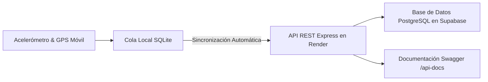
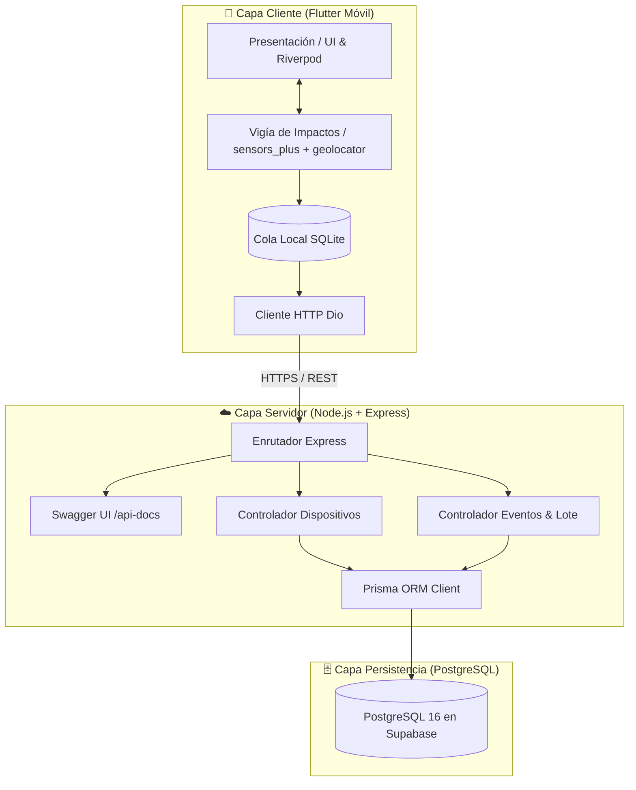
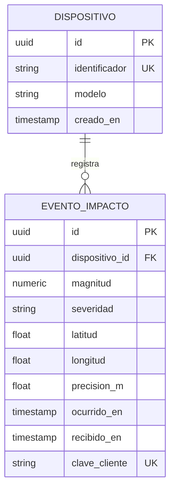
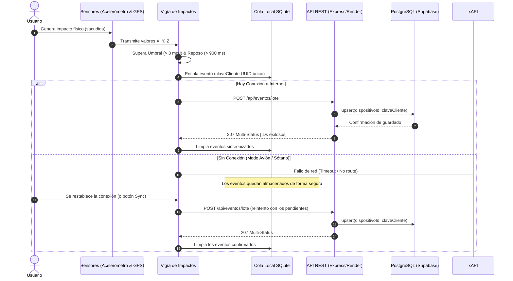

# 📘 Documentación Técnica y de Construcción: PB1 · Bitácora Sísmica CEET

**Programa:** Tecnología en Análisis y Desarrollo de Software (ADSO) — SENA CEET  
**Actividad:** No. 5 – Desarrollo móvil full-stack con Flutter, Dart, API REST, base de datos y sensores del dispositivo  
**Proyecto:** P1 · Bitácora Sísmica CEET  
**Versión:** 1.0.0  

---

## 📑 Tabla de Contenido
1. [Resumen Ejecutivo y Escenario](#1-resumen-ejecutivo-y-escenario)
2. [Arquitectura General del Sistema](#2-arquitectura-general-del-sistema)
3. [Base de Datos: Modelado e Implementación](#3-base-de-datos-modelado-e-implementación)
4. [Backend (API REST): Construcción y Despliegue](#4-backend-api-rest-construcción-y-despliegue)
5. [Frontend (App Móvil Flutter): Construcción e Integración](#5-frontend-app-móvil-flutter-construcción-e-integración)
6. [Mecanismos Clave: Idempotencia y Modo Offline-First](#6-mecanismos-clave-idempotencia-y-modo-offline-first)
7. [Guía de Instalación y Dependencias para un Nuevo PC](#7-guía-de-instalación-y-dependencias-para-un-nuevo-pc)
8. [Guía de Sustentación y Respuestas Técnicas](#8-guía-de-sustentación-y-respuestas-técnicas)

---

## 1. Resumen Ejecutivo y Escenario

### 🎯 Propósito del Proyecto
Monitorear en tiempo real el traslado de equipos delicados en los laboratorios del CEET. La aplicación móvil se instala en el dispositivo del aprendiz o encargado del traslado y detecta vibraciones/impactos físicos mediante el acelerómetro del celular, adjunta la posición geográfica exacta (GPS) y garantiza que ningún dato se pierda ante cortes de conectividad o reinicios del equipo.



---

## 2. Arquitectura General del Sistema

El sistema implementa una arquitectura desacoplada y orientada a servicios:



### 🧱 Principios Arquitectónicos Aplicados:
1. **Clean Architecture en Flutter**: Separación estricta entre `dominio` (entidades y reglas), `datos` (datasources locales y remotos) y `presentacion` (widgets y providers Riverpod).
2. **Offline-First**: Todo impacto se escribe primero en la base SQLite local del dispositivo (`cola_local.dart`) antes de intentar cualquier llamada de red.
3. **Idempotencia Garantizada**: Uso de claves únicas UUID generadas por el cliente (`claveCliente`) y sentencias `upsert` en la base de datos central para evitar duplicidad ante reintentos.

---

## 3. Base de Datos: Modelado e Implementación

### 🗄️ 3.1 Motor y Plataforma
- **Motor:** PostgreSQL 16
- **Hosting:** Supabase (con conexión Pooling a través de Transaction Pooler en el puerto 6543)
- **ORM:** Prisma v7 con `@prisma/adapter-pg`

### 📐 3.2 Diagrama Entidad-Relación



### 📄 3.3 Esquema Prisma (`prisma/schema.prisma`)
```prisma
generator client {
  provider = "prisma-client-js"
}

datasource db {
  provider = "postgresql"
}

model Dispositivo {
  id            String          @id @default(uuid())
  identificador String          @unique
  modelo        String?
  creadoEn      DateTime        @default(now()) @map("creado_en")
  eventos       EventoImpacto[]

  @@map("dispositivo")
}

model EventoImpacto {
  id            String      @id @default(uuid())
  dispositivoId String      @map("dispositivo_id")
  magnitud      Decimal     @db.Decimal(6, 2)
  severidad     String      // 'leve', 'moderado', 'fuerte'
  latitud       Float?
  longitud      Float?
  precisionM    Float?      @map("precision_m")
  ocurridoEn    DateTime    @map("ocurrido_en")
  recibidoEn    DateTime    @default(now()) @map("recibido_en")
  claveCliente  String      @map("clave_cliente")
  dispositivo   Dispositivo @relation(fields: [dispositivoId], references: [id], onDelete: Cascade)

  @@unique([dispositivoId, claveCliente])
  @@index([ocurridoEn(sort: Desc)], map: "idx_evento_fecha")
  @@map("evento_impacto")
}
```

---

## 4. Backend (API REST): Construcción y Despliegue

### ⚙️ 4.1 Tecnologías y Estructura del Backend (`api/`)
- **Runtime:** Node.js (v20+)
- **Framework:** Express 5
- **ORM / Driver:** Prisma 7 + `@prisma/adapter-pg`
- **Documentación:** Swagger UI (`swagger-ui-express` + `swagger-jsdoc`)

### 🛣️ 4.2 Endpoints Implementados

| Método | Ruta | Descripción | Código HTTP Éxito |
| :--- | :--- | :--- | :---: |
| `POST` | `/api/dispositivos` | Registra o recupera el UUID del dispositivo anónimo | `201 Created` |
| `POST` | `/api/eventos` | Registra un impacto individual (Idempotente) | `201 / 200` |
| `POST` | `/api/eventos/lote` | Sube la cola de impactos acumulados sin conexión | `207 Multi-Status` |
| `GET` | `/api/eventos` | Consulta el histórico paginado con filtros de fecha | `200 OK` |
| `GET` | `/api/eventos/resumen` | Conteo de impactos agrupados por severidad y día | `200 OK` |
| `GET` | `/api-docs` | Interfaz interactiva Swagger OpenAPI 3.0 | `200 OK` |

### 🔍 4.3 Código Clave de Idempotencia (`api/src/controladores/eventos.js`)
```javascript
export async function crearEvento(req, res, next) {
  try {
    const { dispositivoId, claveCliente, magnitud, severidad, latitud, longitud, precisionM, ocurridoEn } = req.body;

    if (!dispositivoId || !claveCliente || magnitud == null || !ocurridoEn) {
      return res.status(400).json({ error: 'Faltan campos obligatorios' });
    }

    // Rechazar marcas de tiempo en el futuro
    if (new Date(ocurridoEn) > new Date(Date.now() + 60000)) {
      return res.status(422).json({ error: 'Marca de tiempo en el futuro no permitida' });
    }

    // Upsert para garantizar idempotencia exacta
    const evento = await prisma.eventoImpacto.upsert({
      where: {
        dispositivoId_claveCliente: { dispositivoId, claveCliente },
      },
      update: {}, // Si ya existe, no se duplica ni se altera
      create: {
        dispositivoId,
        claveCliente,
        magnitud: Number(magnitud),
        severidad: severidad || 'moderado',
        latitud: latitud ? Number(latitud) : null,
        longitud: longitud ? Number(longitud) : null,
        precisionM: precisionM ? Number(precisionM) : null,
        ocurridoEn: new Date(ocurridoEn),
      },
    });

    res.status(201).json(evento);
  } catch (error) {
    next(error);
  }
}
```

---

## 5. Frontend (App Móvil Flutter): Construcción e Integración

### 📱 5.1 Arquitectura de Carpetas (`app/lib/`)
```text
app/
├── lib/
│   ├── core/                  # Constantes, temas y utilidades
│   ├── datos/
│   │   ├── local/             # SQLite (cola_local.dart)
│   │   └── servicios/         # api_eventos.dart, vigia_impactos.dart
│   ├── dominio/               # evento_impacto.dart (Entidad y JSON)
│   ├── presentacion/          # providers.dart, monitor_page.dart
│   └── main.dart              # Pantalla principal con pestañas y telemetría
```

### 🧪 5.2 Algoritmo de Detección de Aceleración (`vigia_impactos.dart`)
1. Se suscribe al `accelerometerEventStream(samplingPeriod: SensorInterval.uiInterval)`.
2. Se calcula la magnitud del vector tridimensional:
   $$\text{Magnitud Total} = \sqrt{x^2 + y^2 + z^2}$$
3. Se descuenta la componente gravitatoria terrestre ($\approx 9.80665\text{ m/s}^2$):
   $$\text{Aceleración Neta} = |\text{Magnitud Total} - 9.80665|$$
4. Si la aceleración neta supera el umbral configurable ($\ge 8.0\text{ m/s}^2$) y transcurrió el tiempo de reposo ($\ge 900\text{ ms}$):
   - Se emite feedback háptico diferenciado (`HapticFeedback`).
   - Se obtiene la ubicación GPS actual con `Geolocator`.
   - Se genera una entidad `EventoImpacto` con un `claveCliente = Uuid().v4()`.
   - Se encola en la base SQLite local.
   - Se dispara la sincronización en segundo plano con la API.

---

## 6. Mecanismos Clave: Idempotencia y Modo Offline-First

### 📶 Flujo de Sincronización en Red y Fuera de Red



---

## 7. Guía de Instalación y Dependencias para un Nuevo PC

Para clonar y ejecutar este proyecto desde cero en cualquier computadora nueva, sigue esta guía:

### 🛠️ 7.1 Requisitos Previos en el Sistema Operativo
- **Git** instalado (`git --version`)
- **Node.js** v20+ o v24+ con **npm** (`node -v`, `npm -v`)
- **Flutter SDK** v3.22+ con **Dart** v3.x (`flutter doctor`)
- **Visual Studio Code** o **Android Studio** con extensiones de Flutter y Dart.

---

### ⚡ 7.2 Comandos TODO-EN-UNO para Copiar y Pegar en la Terminal

#### 🟦 BLOQUE 1: Instalar y Correr el Backend (API REST en Node.js + Express + Prisma)
Copia todo este bloque, pégalo en una terminal y presiona **Enter**:

```powershell
cd c:\Actividad5\P1_Bitacora\api ; npm install express @prisma/client @prisma/adapter-pg pg cors dotenv swagger-ui-express swagger-jsdoc uuid ; npm install -D prisma nodemon @types/node @types/express typescript ts-node ; npx prisma generate ; npm run dev
```

*(En Linux / Mac / Git Bash usa:)*
```bash
cd P1_Bitacora/api && npm install express @prisma/client @prisma/adapter-pg pg cors dotenv swagger-ui-express swagger-jsdoc uuid && npm install -D prisma nodemon @types/node @types/express typescript ts-node && npx prisma generate && npm run dev
```

---

#### 🟩 BLOQUE 2: Instalar Sensores y Correr la App Móvil (Flutter + Sensores + SQLite)
Abre una **segunda terminal**, copia todo este bloque, pégalo y presiona **Enter**:

```powershell
cd c:\Actividad5\P1_Bitacora\app ; flutter pub add flutter_riverpod sensors_plus geolocator sqflite path_provider path rxdart dio uuid flutter_dotenv cupertino_icons ; flutter pub get ; flutter run --dart-define=API_BASE_URL=https://apibitacorasismica.onrender.com
```

*(En Linux / Mac / Git Bash usa:)*
```bash
cd P1_Bitacora/app && flutter pub add flutter_riverpod sensors_plus geolocator sqflite path_provider path rxdart dio uuid flutter_dotenv cupertino_icons && flutter pub get && flutter run --dart-define=API_BASE_URL=https://apibitacorasismica.onrender.com
```

---

### 📦 7.3 Tabla Detallada de Dependencias Instaladas

#### Dependencias del Backend (`api/`):
| Dependencia | Versión | Propósito / Función |
| :--- | :--- | :--- |
| `express` | `^5.2.1` | Framework web para crear el servidor HTTP y rutas REST. |
| `@prisma/client` | `^7.9.1` | Cliente tipado ORM para interactuar con PostgreSQL. |
| `@prisma/adapter-pg` | `^7.10.0` | Adaptador oficial de Prisma para pool de conexiones PostgreSQL. |
| `pg` | `^8.13.3` | Driver nativo de conexión y pooling para PostgreSQL. |
| `cors` | `^2.8.6` | Middleware para habilitar solicitudes Cross-Origin entre apps web/móviles y la API. |
| `dotenv` | `^17.4.2` | Carga de variables de entorno seguras desde el archivo `.env`. |
| `swagger-ui-express` | `^5.0.1` | Sirve la documentación interactiva en `/api-docs`. |
| `swagger-jsdoc` | `^6.3.0` | Lee las anotaciones JSDoc y genera la especificación OpenAPI 3.0. |
| `uuid` | `^14.0.2` | Generación de identificadores únicos universales en Node.js. |
| *Dev: `prisma`* | `^7.10.0` | CLI de Prisma para migraciones y generación de esquemas. |
| *Dev: `nodemon`* | `^3.1.14` | Reinicio automático del servidor en desarrollo al guardar cambios. |

#### Dependencias de la App Móvil (`app/`):
| Dependencia | Versión | Propósito / Función |
| :--- | :--- | :--- |
| `sensors_plus` | `^7.1.0` | **Sensor de Acelerómetro**: Lee la aceleración en los ejes X, Y, Z del teléfono físico. |
| `geolocator` | `^14.0.3` | **Sensor GNSS / GPS**: Captura latitud, longitud y precisión métrica del dispositivo. |
| `sqflite` | `^2.4.3` | **Persistencia Local SQLite**: Base de datos offline-first para encolar impactos sin red. |
| `flutter_riverpod` | `^2.6.1` | Gestión de estado reactivo, inyección de dependencias y proveedores con autoDispose. |
| `rxdart` | `^0.27.7` | Extensiones reactivas de Streams (`BehaviorSubject`) para telemetría en tiempo real. |
| `dio` | `^5.11.0` | Cliente HTTP avanzado para consumir la API con timeouts, headers y reintentos. |
| `uuid` | `^4.6.0` | Generación de UUIDs v4 en el cliente para la clave de idempotencia (`claveCliente`). |
| `path_provider` | `^2.1.6` | Acceso a directorios del sistema de archivos local en Android/iOS. |
| `path` | `^1.9.0` | Manipulación segura de rutas de archivos en SQLite. |
| `flutter_dotenv` | `^6.0.1` | Manejo de configuración y URLs base de la API. |
| `cupertino_icons` | `^1.0.8` | Iconografía del sistema. |

**Permisos nativos ya configurados:**
- **Android (`android/app/src/main/AndroidManifest.xml`)**:
  - `android.permission.BODY_SENSORS`
  - `android.permission.ACCESS_FINE_LOCATION`
  - `android.permission.ACCESS_COARSE_LOCATION`
- **iOS (`ios/Runner/Info.plist`)**:
  - `NSMotionUsageDescription`
  - `NSLocationWhenInUseUsageDescription`

**Comando para ejecutar la app móvil:**
```bash
# Ejecutar apuntando a la API en producción de Render:
flutter run --dart-define=API_BASE_URL=https://apibitacorasismica.onrender.com

# O para compilar en web de producción:
flutter build web --release --dart-define=API_BASE_URL=https://apibitacorasismica.onrender.com
```

---

## 8. Guía de Sustentación y Respuestas Técnicas

### ❓ Preguntas Frecuentes del Instructor y Respuestas de Alto Nivel:

1. **¿Por qué se utilizó `upsert` con `(dispositivo_id, clave_cliente)` en lugar de un `INSERT` simple?**  
   *Respuesta:* Para garantizar **idempotencia**. En redes móviles inestables, si la petición se envía pero la respuesta se pierde por corte de red, el teléfono reintentará el envío. El `upsert` asegura que el servidor reconozca el evento existente y no cree duplicados en la base de datos.

2. **¿Por qué el tiempo de reposo se fijó en 900 ms?**  
   *Respuesta:* Un golpe físico real provoca oscilaciones mecánicas y rebotes en el hardware del acelerómetro que duran entre 200 y 600 ms. El tiempo de reposo de 900 ms actúa como filtro paso bajo temporal, asegurando que un solo golpe no se registre falsamente como 5 impactos sucesivos.

3. **¿Qué sucede si el usuario niega el permiso de ubicación (GPS)?**  
   *Respuesta:* Se aplica el principio de **degradación elegante**. La aplicación no se bloquea ni genera excepciones: captura el impacto con el acelerómetro, asigna coordenadas nulas o por defecto y continúa el flujo de registro y sincronización.

4. **¿Por qué se usa Riverpod con `autoDispose` en los sensores?**  
   *Respuesta:* Porque previene **fugas de memoria (memory leaks)** y drenaje de batería. Cuando la vista se destruye o el usuario navega a otra pantalla, Riverpod cancela automáticamente las suscripciones a los streams de los sensores físicos.
