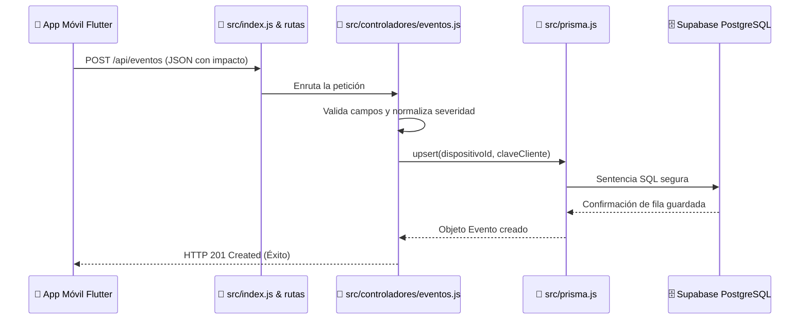

# 🌐 Guía de Entendimiento Total: Backend y API REST (Node.js + Express + Prisma)

> **Dirigido a:** Cualquier persona que quiera entender cómo funciona el servidor desde cero, sin tecnicismos difíciles.

---

## 🧭 1. ¿Qué hace esta API en palabras sencillas?

Imagina que el backend es el **recepcionista y archivador central** de un edificio de laboratorios:
1. **Recibe al visitante (Dispositivo):** Cuando un celular abre la app por primera vez, el servidor le asigna un número de placa único y lo anota en el libro de registros (`dispositivo`).
2. **Anota los accidentes (Eventos de Impacto):** Cada vez que un celular siente una sacudida o golpe fuerte durante el traslado de un equipo, le envía un mensaje al servidor. El servidor revisa que los datos sean reales, clasifica la gravedad (`leve`, `moderado`, `fuerte`) y lo guarda en la base de datos central en la nube (`Supabase`).
3. **Muestra informes (Consultas):** Si el coordinador del laboratorio quiere ver qué golpes han ocurrido hoy o un resumen de cuántos impactos hubo, el servidor consulta el archivo y se lo entrega ordenado.

---

## 📁 2. Estructura de Carpetas del Backend (`api/`)

```text
api/
├── prisma/
│   └── schema.prisma              # 📐 El plano / diseño de la base de datos
├── src/
│   ├── controladores/
│   │   ├── dispositivos.js        # 👤 Lógica para registrar celulares
│   │   └── eventos.js             # 💥 Lógica para guardar y consultar impactos
│   ├── rutas/
│   │   └── index.js               # 🚦 El mapa de carreteras (qué función atiende cada URL)
│   ├── index.js                   # 🚀 El motor principal (inicia el servidor Express)
│   ├── prisma.js                  # 🔌 El enchufe que conecta con la base de datos PostgreSQL
│   └── swagger.js                 # 📖 El manual interactivo visual (/api-docs)
├── package.json                   # 📦 La lista de compras de librerías y comandos
└── .env                           # 🔑 Las contraseñas secretas de conexión a la nube
```

---

## 📄 3. Explicación Archivo por Archivo

---

### 1️⃣ `package.json` — *La Lista de Herramientas del Servidor*
- **¿Qué es?** Es el documento donde se definen el nombre del proyecto, las librerías externas que necesita para funcionar y los comandos para iniciarlo.
- **¿Qué partes tiene?**
  - `"scripts"`: Atajos de teclado. Por ejemplo, `npm run dev` ejecuta `node --watch src/index.js`, lo que hace que el servidor se reinicie automáticamente cada vez que guardas un cambio.
  - `"dependencies"`: Las librerías que usa:
    - `express`: Para crear el servidor web.
    - `@prisma/client` y `pg`: Para hablar con la base de datos PostgreSQL.
    - `cors`: Para permitir que celulares y páginas web puedan hacerle preguntas al servidor sin que el navegador los bloquee por seguridad.
    - `swagger-ui-express`: Para pintar la página web interactiva con la documentación.

---

### 2️⃣ `prisma/schema.prisma` — *El Plano de la Base de Datos*
- **¿Qué es?** Es el contrato que define qué tablas existen en la base de datos y qué columnas tiene cada tabla.
- **¿Qué tablas define?**
  1. **Tabla `dispositivo`**: Guarda los teléfonos.
     - `id`: Código secreto único (UUID).
     - `identificador`: Nombre amigable del celular (ej: `MOVIL-A1B2C3D4`).
     - `modelo`: Tipo de equipo (ej: `App Flutter`).
     - `creadoEn`: Fecha y hora en que se registró.
  2. **Tabla `evento_impacto`**: Guarda cada golpe o sacudida.
     - `id`: Código único del impacto.
     - `dispositivoId`: A qué celular le pertenece este golpe.
     - `magnitud`: Fuerza del golpe medida en $m/s^2$ (ej: 18.50).
     - `severidad`: Etiqueta (`leve`, `moderado` o `fuerte`).
     - `latitud` y `longitud`: Coordenadas GPS de dónde ocurrió.
     - `precisionM`: Qué tan exacto fue el GPS (en metros).
     - `ocurridoEn`: Cuándo ocurrió en el celular.
     - `recibidoEn`: Cuándo llegó al servidor.
     - `claveCliente`: Código único generado por el celular para evitar que un mismo golpe se guarde 2 veces.

---

### 3️⃣ `src/prisma.js` — *El Cable de Conexión a la Base de Datos*
- **¿Qué hace?**
  1. Lee la dirección secreta de la base de datos desde el archivo `.env` (`DATABASE_URL`).
  2. Abre un canal seguro ("Pool de conexiones") con los servidores de **Supabase**.
  3. Crea y exporta el cliente `prisma`, que es el objeto que los controladores usan para hacer `prisma.dispositivo.create()` o `prisma.evento_impacto.findMany()`.

---

### 4️⃣ `src/index.js` — *El Portero y Motor Principal del Servidor*
- **¿Qué hace?**
  1. Es el archivo que se ejecuta primero cuando escribes `npm run dev`.
  2. Crea la aplicación web con `express()`.
  3. Activa los filtros de seguridad: `cors()` (para que cualquier celular se conecte) y `express.json()` (para entender los mensajes en formato JSON).
  4. Conecta el sistema de documentación Swagger en la ruta `/api-docs`.
  5. Conecta las rutas de la API bajo el prefijo `/api`.
  6. Enciende la antena en el puerto `3000` (o el que asigne Render en la nube).

---

### 5️⃣ `src/rutas/index.js` — *El Semáforo / Enrutador*
- **¿Qué hace?** Asocia cada dirección URL con la función que debe atenderla:
  - Si alguien hace `POST /api/dispositivos` ➔ Llama a `registrarDispositivo`.
  - Si alguien hace `POST /api/eventos` ➔ Llama a `crearEvento`.
  - Si alguien hace `POST /api/eventos/lote` ➔ Llama a `crearEventosLote`.
  - Si alguien hace `GET /api/eventos` ➔ Llama a `obtenerEventos`.
  - Si alguien hace `GET /api/eventos/resumen` ➔ Llama a `obtenerResumen`.

---

### 6️⃣ `src/controladores/dispositivos.js` — *El Registro de Teléfonos*
- **Función `registrarDispositivo`**:
  - Recibe el `identificador` que manda el celular (ej: `MOVIL-7B8A91C2`).
  - Utiliza una función llamada `upsert`:
    - Si el celular **es nuevo**, lo inserta en la base de datos.
    - Si el celular **ya estaba registrado**, no crea un duplicado; simplemente devuelve el UUID que ya tenía asignado.

---

### 7️⃣ `src/controladores/eventos.js` — *El Cerebro de los Impactos*
Contiene 4 funciones vitales:

1. **`crearEvento` (Guardar 1 impacto)**:
   - Valida que vengan todos los datos requeridos.
   - **Regla anti-trampas:** Rechaza fechas que vengan en el futuro (si alguien altera la hora del celular).
   - **Idempotencia (`upsert`):** Revisa si la combinación `(dispositivoId, claveCliente)` ya existe. Si ya existe, no hace nada; si es nuevo, lo guarda. Esto garantiza que si el celular reenvía el mismo impacto por fallas de señal, la base de datos **nunca lo duplique**.
2. **`crearEventosLote` (Guardar paquete de impactos)**:
   - Si el celular estuvo en el sótano sin internet y acumuló 10 impactos, al recuperar señal los manda todos juntos en una lista. Esta función recorre la lista y los guarda todos de golpe con código de respuesta `207 Multi-Status`.
3. **`obtenerEventos` (Ver el historial)**:
   - Consulta la base de datos y devuelve todos los impactos ordenados desde el más reciente hasta el más antiguo.
4. **`obtenerResumen` (Contar para las gráficas)**:
   - Agrupa los impactos por día y por severidad para saber cuántos fueron leves, moderados y fuertes.

---

### 8️⃣ `src/swagger.js` — *El Manual Visual Interactivo*
- **¿Qué hace?** Escanea los comentarios especiales en el código y genera la página web gráfica de **Swagger UI** accesible en `/api-docs`. Permite a cualquier evaluador o desarrollador probar todos los endpoints haciendo clic en *"Try it out"* directamente desde el navegador.

---

## 🔄 4. Resumen del Flujo de Datos en el Backend


